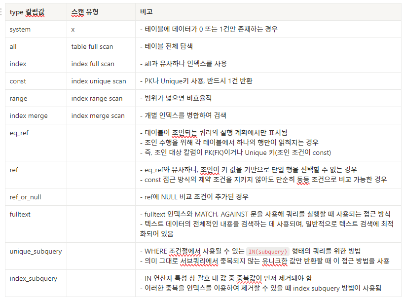

## DB 스캔 종류

### FULL TABLE SCAN

- 인덱스를 활용하지 않고 테이블을 처음부터 끝까지 전부 탐색하는 방식
- 매우 비효율적이며 디스크 I/O의 비용이 많이 발생

### INDEX FULL SCAN

- 인덱스 테이블을 처음부터 끝까지 전부 탐색하는 방식
- 실제 테이블보다 상대적으로 적은 양을 차지하므로 일반적으로 full table scan보다 효율적
- 하지만 index full scan도 결국 인덱스 테이블 “전체”를 읽어야 함
- B+ 트리에서 첫 번째 leaf 노드를 수직 탐색 후 나머지 leaf 노드에 대해 순차적으로 전체 탐색을 진행

### INDEX UNIQUE SCAN

- 조회하고자 하는 1건의 데이터를 단번에 찾아오는 경우
- 즉 고유 인덱스(UNIQUE)나 PK를 사용해서 1건의 데이터만 조회한 경우에 해당
- 인덱스를 사용하는 방식 중 가장 효율적인 스캔 방식

### INDEX RANGE SCAN

- 인덱스를 활용해 범위 형태의 데이터를 조회하는 경우
- BETWEEN, 부등호(<, >, ≤, ≥), IN, LIKE이 이에 해당
- 인덱스를 사용하기 때문에 기본적으로 효율적인 방식이나, 그 범위가 넓을 경우 성능이 저하됨

### INDEX LOOSE SCAN

- 인덱스에서 필요한 부분만 선택하여 스캔
- index range scan처럼 넓은 범위에 전부 접근하지 않고, where 조건문을 기준으로 불필요한 데이터를 구분한 뒤 해당 인덱스 키는 무시

### INDEX MERGE SCAN

- 두 개 이상의 인덱스를 병합하여 검색
- where 문의 조건 열이 서로 다른 인덱스에 존재할 때 사용됨
- 물리적으로 존재하는 개별 인덱스를 각각 접근하므로 인덱스에 접근하는 시간이 오래 걸림
- 따라서 보통 별개로 생성된 인덱스들을 하나의 인덱스로 통합하여 튜닝함

---

## EXPLAIN Type 칼럼 맵핑

---

### References

- [**비전공자도 이해할 수 있는 MySQL 성능 최적화 입문/실전 (SQL 튜닝편)**](https://www.inflearn.com/course/%EB%B9%84%EC%A0%84%EA%B3%B5%EC%9E%90-mysql-%EC%84%B1%EB%8A%A5%EC%B5%9C%EC%A0%95%ED%99%95-sql%ED%8A%9C%EB%8B%9D?srsltid=AfmBOopMiTIKspGSsqTKmPwjUhYhAgFf6i2XyWLqCrZBmn-Lhxv9Nxm_)
- [SQL 튜닝 용어 정리(3) - Never Ending Study - 티스토리](https://mungiyo.tistory.com/42)
- [MySQL튜닝2) SQL 튜닝 용어 이해하기2 - 육지거북이](https://land-turtler.tistory.com/134)
- [[MySQL] 실행계획2 (EXPLAIN)](https://velog.io/@ddongh1122/MySQL-%EC%8B%A4%ED%96%89%EA%B3%84%ED%9A%8D2-EXPLAIN)
- [[MySQL] 실행계획 (Execution Plan) - (2) type](https://hwannny.tistory.com/100)
